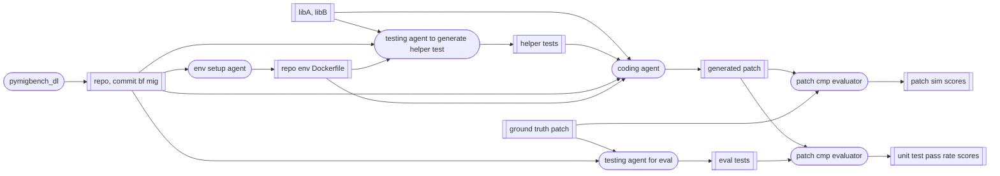

## TODO

- [ ] b/f Oct 24: Set up fallback ver of swe-agent (no exec on repo)

- [ ] b/f Oct 24: Set up evaluator

- [ ] b/f Oct 24: Set up env for more repos

- [ ] b/f Oct 24: Ignore testing agent, and run on 30 data points

## Schedule

Teammate's schedule starting from Oct 21:

- Yogesh: This week not free, next week free

- Shanru: This week online (time zone diff, subtract 3 hours), next week free till Wednesday

## Architecture

